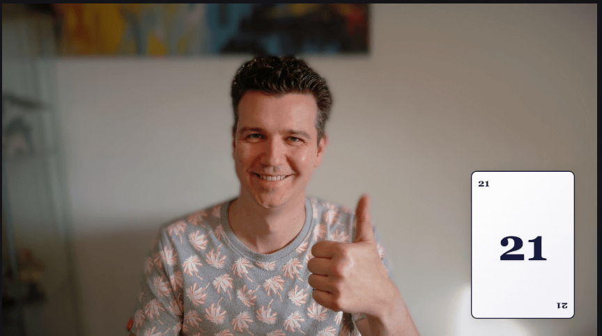
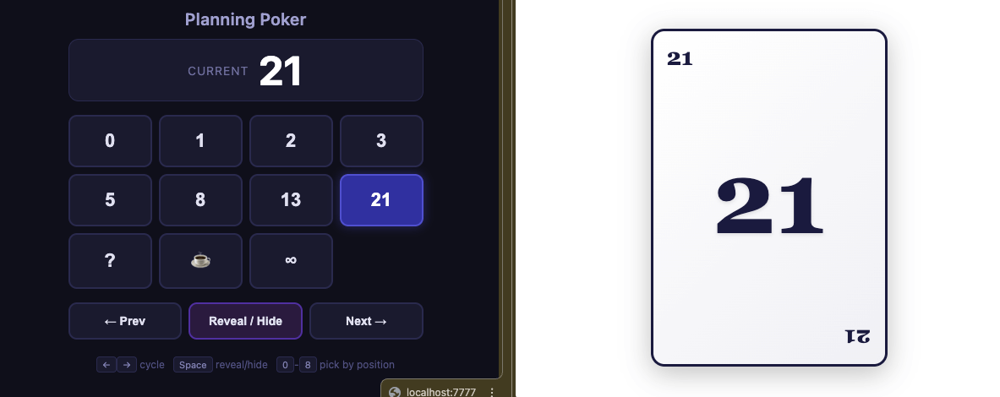

# OBS Planning Poker

A native desktop app for showing planning poker cards as an OBS overlay. Built with Tauri — a single `.app` / `.dmg` replaces the old Node.js server entirely.

## Preview

**Control panel & card overlay**



**In action — card overlay composited in OBS**



## How it works

The app has two parts:

- **Native panel** — A Tauri window where you pick a card value, cycle through values, and reveal/hide the card. Can be pinned always-on-top.
- **Card overlay** — A local HTTP server (axum) serves the card page at `http://localhost:7777/card`. Add this as a Browser Source in OBS. Transparent background, composites cleanly over your scene.

The panel communicates with the overlay via WebSocket so state stays in sync instantly. Revealing/hiding flips the card with a CSS 3D animation.

## Install

Download the latest release from the [Releases](https://github.com/dariusrosendahl/obs-planning-poker/releases) page:

- **macOS** — `.dmg` (Apple Silicon and Intel)
- **Windows** — `.msi` or `.exe` installer

### macOS: "damaged" warning

macOS blocks unsigned apps downloaded from the internet. After downloading, run this in Terminal before opening the `.dmg`:

```bash
xattr -cr ~/Downloads/Planning.Poker_*.dmg
```

Then open the DMG and drag the app to Applications as usual.

### Build from source

```bash
pnpm install
pnpm tauri:build
```

The built app is at `src-tauri/target/release/bundle/macos/Planning Poker.app`.

## OBS setup

1. Add a **Browser Source** to your scene.
2. Set the URL to `http://localhost:7777/card` (port is configurable in settings).
3. Set width to **280** and height to **400**.
4. Check "Shutdown source when not visible" if you like.
5. The background is transparent — the card floats over your scene.

## Panel controls

| Control | Action |
|---------|--------|
| Click a value | Select that card |
| `Reveal / Hide` button | Flip the card face-up or face-down |
| `Prev` / `Next` buttons | Cycle through values |
| Arrow keys | Cycle through values |
| Spacebar | Toggle reveal/hide |
| Number keys `0`–`8` | Select card by position (first nine values) |
| Pin button | Float the panel as an always-on-top window |
| Gear button | Open settings to change the server port |

## Card values

`0` `1` `2` `3` `5` `8` `13` `21` `?` `☕` `∞`

## Configuration

Open the settings panel (gear icon) to change the server port. Default is **7777**. Changes take effect after restarting the app.

## Project structure

```
src/
  panel/          Control panel UI (HTML/CSS/JS, served by Tauri)
src-tauri/
  src/
    main.rs       App entry point and Tauri setup
    server.rs     Axum HTTP + WebSocket server for card overlay
    state.rs      Card state machine
    types.rs      Message types
    commands.rs   Tauri IPC command handlers
    config.rs     Persistent port configuration
public/
  card/           Browser source overlay (HTML/CSS/JS)
```

## Development

```bash
pnpm install
pnpm tauri:dev
```

## Requirements

- Rust (for building)
- pnpm
- macOS 10.15+ or Windows 10+

## License

MIT
